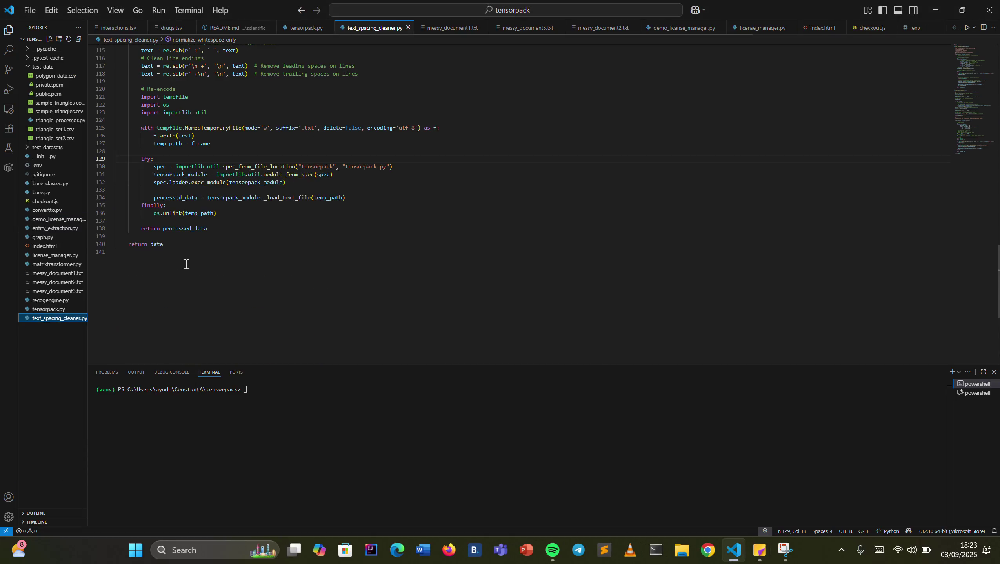
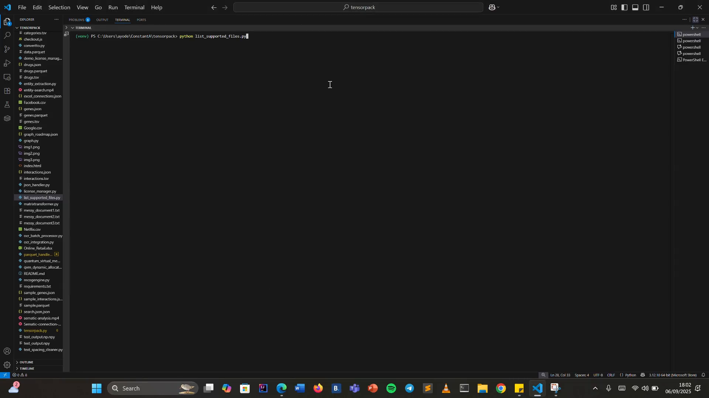
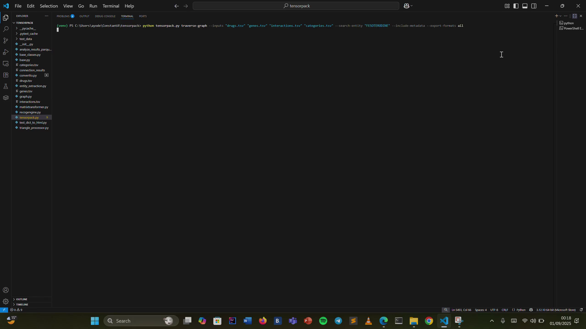
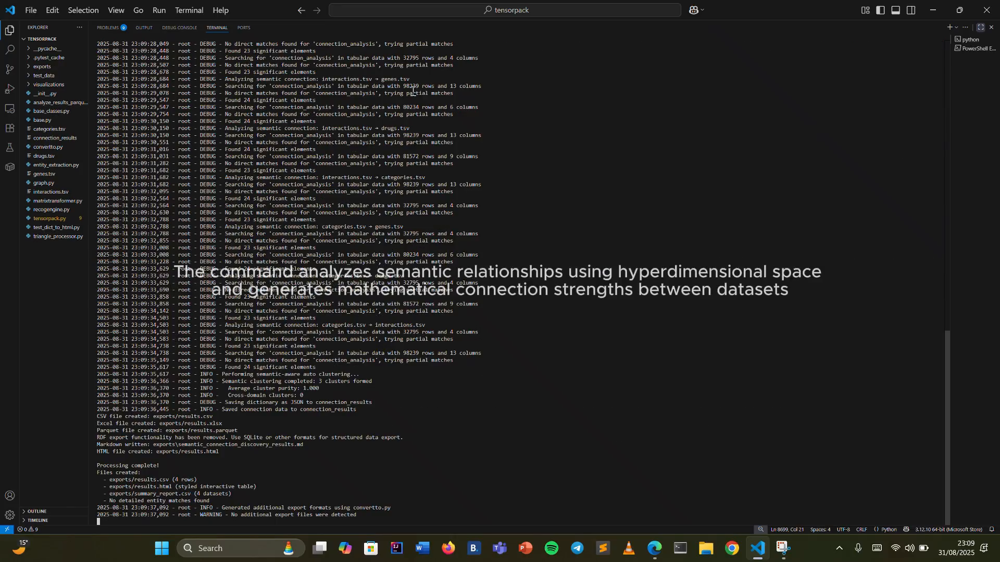
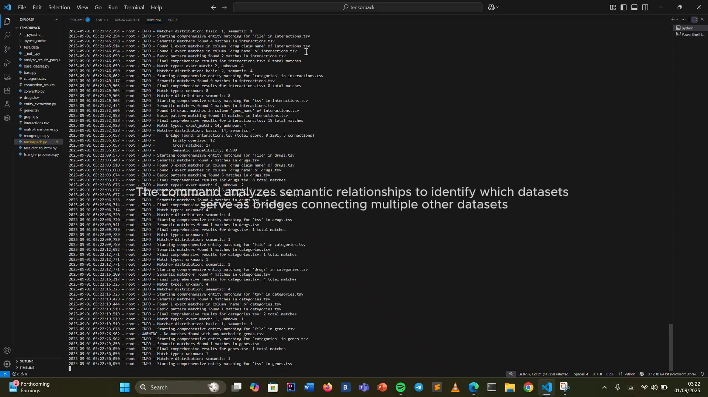

# TensorPack

[](https://pypi.org/project/tensorpack-f/)
[](https://pypi.org/project/tensorpack-f/)
[](https://github.com/fikayoAy/tensorpack/blob/main/LICENSE)


## What it is

_A compact CLI toolkit to convert, analyze and discover relationships across datasets (tensors, matrices, tabular, text and more)._  

TensorPack is a software product with a command-line interface (CLI) that helps convert and analyze data between different formats. It focuses on converting tensors (multi-dimensional arrays) to matrices (2D arrays) and vice versa, and it also helps discover and understand connections between different datasets.

TensorPack builds upon the foundation of [MatrixTransformer](https://github.com/fikayoAy/MatrixTransformer), providing a higher-level interface and additional features for data analysis and transformation. While MatrixTransformer offers core matrix manipulation capabilities, TensorPack extends these with comprehensive CLI tools, semantic analysis, relationship discovery, and visualization features for complex data workflows.

## Supported File Formats

TensorPack supports a wide range of input and output formats:

### Data Formats
- **JSON**: `.json` - Structured data with support for multi-dimensional arrays
- **CSV/TSV**: `.csv`, `.tsv` - Comma and tab-separated values
- **Excel**: `.xlsx`, `.xls` - Microsoft Excel workbooks
- **NumPy**: `.npy`, `.npz` - NumPy binary array formats (optimized for large datasets)

### Media Formats
- **Images**: `.jpg`, `.jpeg`, `.png`, `.bmp`, `.tif`, `.tiff`, `.gif` - With optional OCR text extraction
- **Videos**: `.mp4`, `.avi`, `.mov`, `.wmv`, `.flv`, `.mkv`, `.webm` - Frame-based analysis supported

### Text Formats
- **Documents**: `.txt`, `.md`, `.html`, `.xml` - Plain text and markup formats
- **Source Code**: `.py`, `.js`, `.java`, `.c`, `.cpp`, `.h`, `.rb`, `.go`, `.rs`, `.php`, `.ts` - Programming language files

### Custom Format Support
TensorPack supports **extensible format handling** through custom transforms. You can add support for any proprietary or specialized format (including `.parquet`, `.hdf5`, `.mat`, etc.) by registering custom Python transforms that act as file loaders.
# Quick Note
custom format support is not avaiable via programmatic use but avaiable in pypi you can download via python -m pip install tensorpack-f==0.1.8


## CLIP-based Semantic Extraction

TensorPack now uses a CLIP-based semantic extractor for images and videos (via `open_clip`).
This replaces the earlier OCR-first approach. Note:

- CLIP does not perform OCR or provide bounding boxes. Instead it produces
  image embeddings useful for semantic search, similarity and zero-shot
  classification.
- The default model configured is a Metaclip variant (`metaclip_400m`) with
  `ViT-B-32` but you can change this via the `configure_clip` function in
  `tensorpack.ocr_integration` (keeps backwards-compatible alias `configure_ocr`).

Quick example (Python):

```python
import open_clip
model, _, preprocess = open_clip.create_model_and_transforms('ViT-B-32', pretrained='metaclip_400m')
tokenizer = open_clip.get_tokenizer('ViT-B-32')
```

If you need true OCR with bounding boxes, keep using an external OCR tool
or add a custom transform that wraps an OCR backend (e.g., Tesseract or
PaddleOCR).

## Table of Contents

- [Pain Point Analysis](#pain-point-analysis)
  - [Core Problem](#core-problem)
  - [How TensorPack Helps](#how-tensorpack-helps)
  - [Benefits](#benefits)
- [How It Works](#how-it-works)
  - [1. Adding Custom Transformations](#1-adding-custom-transformations)
  - [2. Entity Search & Analysis](#2-entity-search--analysis)
  - [3. Semantic Connection Discovery](#3-semantic-connection-discovery)
  - [4. Semantic Analysis](#4-semantic-analysis)
- [License](#license)
  - [License Types](#license-types)
  - [Machine Binding](#machine-binding)
- [Installation](#installation)
- [Return Structure Documentation](#return-structure-documentation)
- [Command Reference](#command-reference)

## Pain Point Analysis

_High-level problems TensorPack aims to solve._


---
### Core Problem

_Complex, multi-dimensional data is hard to convert and analyze while preserving relationships._  

Working with complex, multi-dimensional data (tensors) is difficult. Converting them into usable formats often breaks important relationships, and analyzing connections across different datasets requires time, expertise, and custom code.

---
### How TensorPack Helps

_Core capabilities that make data conversion and discovery practical and repeatable._

1. **Seamless Data Conversion**
  - Easily switch between tensors (multi-dimensional arrays) and matrices (2D arrays).
  - Preserve relationships and metadata during transformations.
2. **Custom Data Transformations**
  - Define your own transformation rules using Python, external executables, or config files.
  - Adapt to diverse data sources and domains without rewriting code.
3. **Relationship Discovery**
  - Automatically detect and analyze relationships across datasets.
  - Includes semantic analysis, entity linking, and visualization support.
4. **Explorable Connections**
  - Navigate data as a graph: find pathways, discover bridges, and search across datasets.
  - Export results in multiple formats for further analysis.


### Benefits

_What teams gain by using TensorPack._

- **Reduced Complexity:** Simplifies handling of multi-dimensional, multi-modal data.
- **Semantic Preservation:** Maintains meaning and relationships across all transformations.
- **Automation:** Automatically discovers relationships and patterns across datasets, images, and videos.
- **Flexibility:** Handles standard formats (json, csv, excel) and multi-modal inputs.
- **Custom Transform Extensibility:** Users can add support for proprietary formats (text, tabular, images, videos) via Python, external executables, or configuration files.
- **Rich Visualization & Export:**
  - **Visuals:** Interactive html visualizations, png static plots, publication-ready pdf reports
  - **Data/Analysis:** json, csv, excel, parquet, sqlite
  - **Documentation:** markdown, html
- **Contextual Understanding:** Retains semantic context and relationships across all operations, ensuring results remain meaningful and interpretable.
---

## How It Works

_A brief workflow overview showing what you can do with TensorPack._

### 1. Adding Custom Transformations
_Register reusable transforms to convert, load or extend data formats (Python, executables, configs)._  
Click the thumbnail to open the demo video.
[](https://youtu.be/MPjSGoGCelQ)

```bash
# Add a custom transformation
tensorpack add-transform \
  --name "custom_transform" \
  --data-type "matrix" \
  --source-type "python" \
  --source "transform.py" \
  --function-name "transform_func" \
  --properties "dimension=3,normalize=true" \
  --export-formats "json,html,excel"
```

#### Custom file loader — Extension via custom Transform
_Add a transform that can act as a file loader (for example, register a Parquet loader)._  
Click the thumbnail to open the demo video.
[](https://youtu.be/WqD-OlNqjMs)

### Simple walkthrough

Register a new custom Python transform (parquet handler)
```bash
tensorpack add-transform \
  --name parquet_handler \
  --data-type custom \
  --source-type python \
  --source ./parquet_handler.py \
  --properties handles_format=.parquet,maintains_metadata=true \
  --test-data sample.parquet \
  --test-output test_output.np
```

| Flag | Description |
|---|---|
| `--name parquet_handler` | The registry name for the transform. |
| `--data-type custom` | Category under which the transform is registered (used to filter transforms). |
| `--source-type python` | Indicates the transform is loaded from a Python file. |
| `--source ./parquet_handler.py` | Path to the Python source implementing the transform. |
| `--properties handles_format=.parquet,maintains_metadata=true` | Transform metadata describing handled formats and behavior. |
| `--test-data sample.parquet` | Run the transform on this sample file as a sanity check during registration. |
| `--test-output test_output.np` | Path to save the test run output for inspection. |

See the full registration reference: `docs/commands/add_transfrom.md`.

---

List installed transforms of type `custom`
```bash
tensorpack list-transforms --data-type custom
```

| Flag | Description |
|---|---|
| `--data-type custom` | Filters the list to transforms registered under the `custom` category. |

Use the registered transform while traversing and searching entities
```bash
tensorpack traverse-graph \
  --inputs genes.parquet \
  --search-entity "PPARG" \
  --include-metadata \
  --export-formats all \
  --output search.json \
  --apply-transform parquet_handler \
  --verbose
```

| Flag | Description |
|---|---|
| `--inputs genes.parquet` | Input dataset(s) to analyze; transforms that declare `handles_format` can be applied automatically. |
| `--search-entity "PPARG"` | The entity term to search for across datasets. |
| `--include-metadata` | Include dataset and transform metadata in the output for richer context. |
| `--export-formats all` | Export results in all supported formats (json, html, csv, etc.). |
| `--output search.json` | Path to save the exported search results. |
| `--apply-transform parquet_handler` | Explicitly apply the named transform during data loading. |
| `--verbose` | Enable detailed logging during the run. |

TensorPack allows you to extend its file loading capabilities by registering a custom transform that acts as a file loader for new formats. For example, you can add support for `.parquet` files (or any other format not natively supported) by:

1. **Implementing a custom Python transform** that loads the new file type (e.g., using `pandas.read_parquet`).
2. **Registering the transform** with `tensorpack add-transform`, specifying the file type and indicating that the transform handles loading (using the `handles_format` property in the transform metadata).
3. **Using the transform** in CLI commands (e.g., `--apply-transform parquet_handler`) to load and process files of the new type, even though TensorPack itself does not have built-in support for that format.

This approach enables seamless integration of proprietary or emerging file formats into your TensorPack workflows, without modifying the core codebase. The video above demonstrates registering and using a custom `.parquet` file loader as a transform.

### 2. Entity Search & Analysis
_Search, extract and analyze named entities across multiple datasets for discovery and linking._  
Click the thumbnail to open the demo video.
[](https://youtu.be/5YMdhLGR6zs)

```bash
# Search for entities across datasets
tensorpack traverse-graph \
  --inputs "dataset1.json" "dataset2.csv" \
  --search-entity "Term" \
  --include-metadata \
  --export-formats "json,html,excel,graphml" \
  --output "entity_analysis"
```

---

### 3. Semantic Connection Discovery
_Discover semantic links, pathways and contextual relationships between datasets._  
Click the thumbnail to open the demo video.
[](https://youtu.be/r9pMhrHTcfI)

```bash
# Discover semantic connections
tensorpack discover-connections \
  --source "source_data.json" \
  --target "target_data.json" \
  --depth 3 \
  --min-confidence 0.7 \
  --include-context \
  --export-formats "all" \
  --output "semantic_connections"
```

---

### 4. Semantic Analysis
_Perform in-depth semantic extraction and visualization to contextualize dataset content._  
Click the thumbnail to open the demo video.
[](https://youtu.be/CdMyyu1ZKeo)

```bash
# Perform semantic analysis
tensorpack analyze-semantic \
  --input "dataset.json" \
  --model "transformer-large" \
  --extract-entities \
  --include-relationships \
  --visualize \
  --export-formats "html,json,neo4j" \
  --output "semantic_analysis"
```

---

Each command supports various export formats:
- `json`: Structured data output
- `csv`: Tabular format
- `excel`: Microsoft Excel workbook
- `html`: Interactive visualizations
- `parquet`: Columnar storage format
- `sqlite`: Relational database
- `png`: Static visualizations
- `markdown`: Documentation format

Use `--export-formats all` to export in all available formats, or specify individual formats with comma-separated values.


## Installation

**Requirements**: Python 3.9 or higher

**Recommended Setup**: Create a virtual environment to avoid dependency conflicts:

```bash
# Create a virtual environment
python -m venv tensorpack

# Activate the virtual environment (Windows PowerShell)
tensorpack\Scripts\Activate.ps1

# Install TensorPack
python -m pip install tensorpack-f==0.1.8

# Verify installation
tensorpack --help
```

**Quick Install** (if you prefer to install globally):

```bash
python -m pip install tensorpack-f==0.1.8
```

## Quick Reference

After installation, get an overview of all available commands:

```bash
tensorpack --help
```

```
usage: tensorpack [-h] [--activate-license ACTIVATE_LICENSE] [--verbose] [--output OUTPUT] [--json] [--log LOG]
                  {tensor_to_matrix,matrix_to_tensor,discover-connections,traverse-graph,add-transform,list-transforms,describe-transform,remove-transform,activate-license,license-info,usage-status,upgrade}
                  ...

TensorPack: CLI tool for tensor-matrix conversions and transformations

positional arguments:
  {tensor_to_matrix,matrix_to_tensor,discover-connections,traverse-graph,add-transform,list-transforms,describe-transform,remove-transform,activate-license,license-info,usage-status,upgrade}
                        Command to execute
    tensor_to_matrix    Convert tensor to matrix
    matrix_to_tensor    Convert matrix to tensor
    discover-connections
                        Discover hidden connections between matrices/tensors with multiple export formats
    traverse-graph      Discover semantic connections between datasets using three focused exploration modes with multiple export       
                        formats
    add-transform       Add a custom transformation to TensorPack
    list-transforms     List available transformations
    describe-transform  Describe a specific transformation
    remove-transform    Remove a transformation from the registry
    activate-license    Activate a license key
    license-info        Show current license information
    usage-status        Show daily usage statistics (free tier)
    upgrade             Show upgrade information and open upgrade page

optional arguments:
  -h, --help            show this help message and exit
  --activate-license ACTIVATE_LICENSE
                        Activate a license key (paste the key here) (default: None)
  --verbose, -v         Enable verbose logging (default: False)
  --output OUTPUT, -o OUTPUT
                        Output file path (default: None)
  --json                Output in JSON format (default: False)
  --log LOG             Log to file (default: None)
```

### Getting Help for Specific Commands

To see detailed help for any subcommand, use:

```bash
tensorpack <command> --help
```

Examples:
```bash
# Get help for tensor conversion
tensorpack tensor_to_matrix --help

# Get help for discovering connections
tensorpack discover-connections --help

# Get help for graph traversal
tensorpack traverse-graph --help

# Get help for adding custom transforms
tensorpack add-transform --help
```

## Return Structure Documentation

These documents explain the data structures returned by key TensorPack commands:

- [Discover Connections Command](docs/dc_return-structure.md) - Explains the return structure of the `discover_connections_command`, which finds relationships between datasets.
- [Traverse Graph Command](docs/tg_return_structure.md) - Details the return structure of the `traverse_graph_command`, which explores connections between entities through different traversal modes.

## Command reference

Detailed command documentation is available in the `docs/commands` folder. See the following markdown files for usage, flags, and examples for each command:

- [Add Transform](docs/commands/add_transfrom.md) — Add and manage custom transforms (register loaders, transformers and exporters).
- [Discover Connection](docs/commands/discover_connection.md) — Discover semantic and contextual connections between datasets.
- [Matrix to Tensor](docs/commands/matrix_to_tensor.md) — Convert matrices back into tensor representations with metadata preservation.
- [Tensor to Matrix](docs/commands/tensor_to_matrix.md) — Convert tensors into matrices with optional normalization and metadata extraction.
- [Traverse Graph](docs/commands/traverse_graph.md) — Traverse dataset graphs, search entities and find pathways across inputs.

There are also example media and additional notes in the [img directory](docs/commands/img/) and sample datasets in the [sample_data directory](docs/commands/sample_data/) to help you get started.


